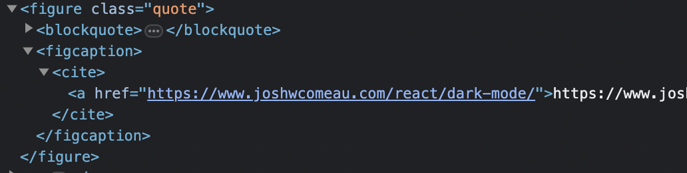

I am using a custom rehype plugin to wrap blockquote elements in my markdown with `figure`, `figcaption`, and `cite` elements in order to better present the excerpts.

```md
> Example quote – https://example.com
```



### Here is the plugin code

```javascript
import { visit } from "unist-util-visit";
import { h } from "hastscript";

export default () => {
  return (ast, file) => {
    visit(
      ast,
      (x) => x.tagName === "blockquote",

      (node, idx, parent) => {
        const paragraph = node.children[1];
        const quote = paragraph.children.slice(
          0,
          paragraph.children.length - 1
        );
        const cite = paragraph.children.slice(-1);

        quote[quote.length - 1].value = quote[quote.length - 1].value.replace(
          /[—|–].*$/,
          ""
        );

        parent.children[idx] = h("figure", { class: "quote" }, [
          h("blockquote", {}, quote),
          h("figcaption", {}, [h("cite", {}, cite)]),
        ]);
      }
    );
  };
};
```
