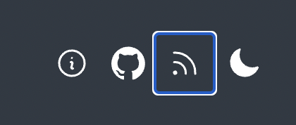
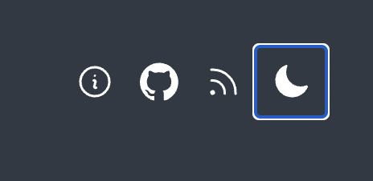

First and foremost I wanted this site to be progressively enhanced. The viewer should get the color scheme they prefer based on the `@media` query `prefers-color-scheme` which only requires CSS. If Javascript is available, then I can offer some additional features like toggling the color scheme as well as storing the viewer's preference if they decide to override the initial theme by clicking the sun/moon icon in the header.

[Josh Comeau](https://www.joshwcomeau.com/react/dark-mode/) has a great set of requirements which I used for my implementation:

- The user should be able to click a toggle to switch between Light and Dark mode.
- The user's preference should be saved, so that future visits use the correct color theme.
- It should default to the user's "preferred" color scheme, according to their operating system settings. If not set, it should default to Light.
- The site should not flicker on first load, even if the user has selected a non-default color theme.
- The site should never show the wrong toggle state.

My implementation differs from Josh's as I am using a [custom web component](https://developer.mozilla.org/en-US/docs/Web/API/Web_components) instead of react.

```javascript
import { COLORS } from "../constants.js";

class ColorMode extends HTMLElement {
  /** @type {'light' | 'dark' | null} */
  _colorMode = null;

  constructor() {
    super();
    this.attachShadow({ mode: "open" });
    this.toggleColorMode = this.toggleColorMode.bind(this);

    const colorMode = window.localStorage.getItem("color-mode");
    const hasStoredColorMode = typeof colorMode === "string";
    const mql = window.matchMedia("(prefers-color-scheme: dark)");
    const hasMediaQueryPreference = typeof mql.matches === "boolean";

    // If the viewer has a stored color mode then use that
    if (hasStoredColorMode) {
      this.colorMode = colorMode === "dark" ? "dark" : "light";
    } else if (hasMediaQueryPreference) {
      // Otherwise check if there is a media query preference
      const mediaMatch = mql.matches ? "dark" : "light";
      this.colorMode = mediaMatch;
    }

    this.render();
  }

  connectedCallback() {
    if (this.shadowRoot) {
      this.shadowRoot.addEventListener("click", this.toggleColorMode);
    }
  }

  disconnectedCallback() {
    if (this.shadowRoot) {
      this.shadowRoot.removeEventListener("click", this.toggleColorMode);
    }
  }

  render() {
    if (!this.shadowRoot) {
      return;
    }

    const icon = this.colorMode === "light" ? this.sun : this.moon;
    const oppositeMode = this.colorMode === "light" ? "dark" : "light";
    this.shadowRoot.innerHTML = `<style>
      svg { 
        width: 24px; 
        height: 24px;
        padding: 10px;
        cursor: pointer;
      } 
      div {
        display:flex;
      }
    </style>
    <div tabindex="0" title="Activate ${oppositeMode} theme">${icon}</div>`;
  }

  toggleColorMode() {
    const newMode = this.colorMode === "light" ? "dark" : "light";
    window.localStorage.setItem("color-mode", newMode);
    this.colorMode = newMode;
    this.render();
  }

  get colorMode() {
    return this._colorMode;
  }

  /** @param {'light' | 'dark' | null} mode */
  set colorMode(mode) {
    this._colorMode = mode;

    if (!mode) {
      return;
    }

    const root = window.document.documentElement;

    Object.entries(COLORS).forEach(([name, colorByTheme]) => {
      const cssVarName = `--color-${name}`;
      root.style.setProperty(cssVarName, colorByTheme[mode]);
    });
  }

  get moon() {
    // https://heroicons.com/ MIT
    return `<svg
        xmlns="http://www.w3.org/2000/svg"
        viewBox="0 0 24 24"
        fill="currentColor"
        class="w-6 h-6"
      >
        <path
          fill-rule="evenodd"
          d="M9.528 1.718a.75.75 0 01.162.819A8.97 8.97 0 009 6a9 9 0 009 9 8.97 8.97 0 003.463-.69.75.75 0 01.981.98 10.503 10.503 0 01-9.694 6.46c-5.799 0-10.5-4.701-10.5-10.5 0-4.368 2.667-8.112 6.46-9.694a.75.75 0 01.818.162z"
          clip-rule="evenodd"
        />
      </svg>`;
  }

  get sun() {
    // https://heroicons.com/ MIT
    return `<svg
      xmlns="http://www.w3.org/2000/svg"
      viewBox="0 0 24 24"
      fill="currentColor"
      class="w-6 h-6"
    >
      <path
        d="M12 2.25a.75.75 0 01.75.75v2.25a.75.75 0 01-1.5 0V3a.75.75 0 01.75-.75zM7.5 12a4.5 4.5 0 119 0 4.5 4.5 0 01-9 0zM18.894 6.166a.75.75 0 00-1.06-1.06l-1.591 1.59a.75.75 0 101.06 1.061l1.591-1.59zM21.75 12a.75.75 0 01-.75.75h-2.25a.75.75 0 010-1.5H21a.75.75 0 01.75.75zM17.834 18.894a.75.75 0 001.06-1.06l-1.59-1.591a.75.75 0 10-1.061 1.06l1.59 1.591zM12 18a.75.75 0 01.75.75V21a.75.75 0 01-1.5 0v-2.25A.75.75 0 0112 18zM7.758 17.303a.75.75 0 00-1.061-1.06l-1.591 1.59a.75.75 0 001.06 1.061l1.591-1.59zM6 12a.75.75 0 01-.75.75H3a.75.75 0 010-1.5h2.25A.75.75 0 016 12zM6.697 7.757a.75.75 0 001.06-1.06l-1.59-1.591a.75.75 0 00-1.061 1.06l1.59 1.591z"
      />
    </svg> `;
  }
}

customElements.define("color-mode", ColorMode);
```

The key is to include this script as a blocking script in the document head.

```html
<script src="/js/color-mode.js"></script>
```

By initially setting the CSS custom properties on `:root` in the stylesheet I can later set the values on the `document` and they will take precedence due to proximity.

```css
/* From stylesheet */
  :root {
    --color-background: #FAFAFA;
    --color-text: #050505;
    --color-primary: #0077B2;
  }

  @media (prefers-color-scheme: dark) {
    :root {
      --color-background: #303943;
      --color-text: #ffffff;
      --color-primary: #B1DBEF;
    }
  }
}
```

Then within the web component, if the user clicks the sun/moon icon in the header the values are updated and set on the `document` which takes precedence due to proximity.

```javascript
// JS used in the component to set theme CSS custom properties
Object.entries(COLORS).forEach(([name, colorByTheme]) => {
  const cssVarName = `--color-${name}`;
  root.style.setProperty(cssVarName, colorByTheme[mode]);
});
```

## Making it more accessible
I noticed with my first iteration of the component that it didn't participate in the tab order. Trying to tab from feed to moon icon did not work.



I fixed this by adding `tabindex="0"` to the parent div.

```html
<div tabindex="0" title="Activate ${oppositeMode} theme">${icon}</div>
```

