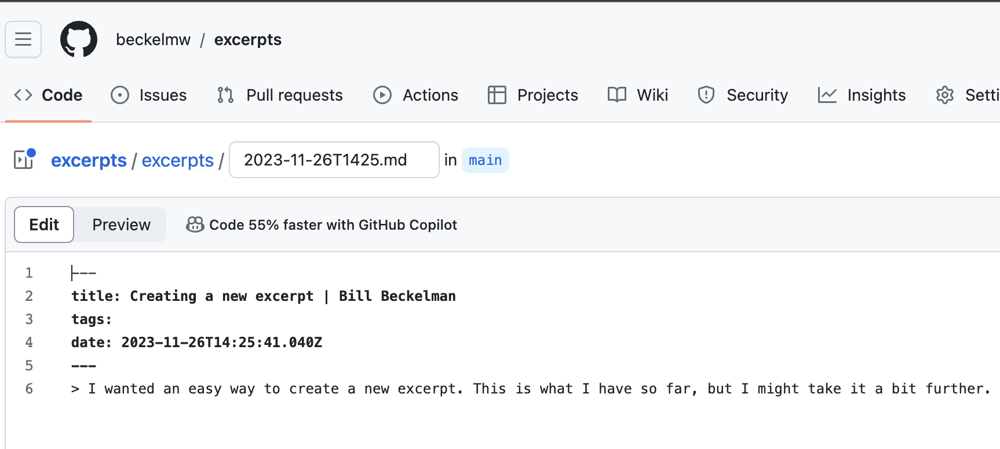

I've come up with severalways to create new excerpt. Check them out below.

## Creating via nodejs

I wanted an easy way to create a new excerpt. This is what I have so far, but I might take it a bit further. I am not currently using a launcher like [ScriptKit](https://www.scriptkit.com/), [Raycast](https://www.raycast.com/) or [Alfred](https://www.alfredapp.com/) which would probably make this easier.

Here is the flow:

1. I find and copy an excerpt in Google Chrome
1. I then run the script below from terminal
1. The script uses AppleScript to get the title and URL of the active tab in Chrome
1. The script creates a markdown file with this information and writes it to the filesystem
1. The new markdown file is opened in vscode

```js
import { writeFile } from "fs/promises";
import { join } from "path";
import { execa } from "execa";
import clipboard from "clipboardy";

const today = new Date().toISOString().slice(0, 16).replace(":", "");

function getChromeScriptFor(type) {
  return `tell application "Google Chrome" to return ${type} of active tab of front window`;
}

const { stdout: title } = await execa("osascript", [
  `-e ${getChromeScriptFor("title")}`,
]);

let md = `---
title: ${title}
tags:
date: ${new Date().toISOString()}
---`;

const quote = await clipboard.read();
if (quote) {
  md += "\n";
  md += `> ${quote}`;
}

const { stdout: url } = await execa("osascript", [
  `-e ${getChromeScriptFor("URL")}`,
]);

if (url) {
  md += ` — ${url}`;
}

const filePath = join(
  process.env.HOME,
  `projects/excerpts/excerpts/${today}.md`
);

await writeFile(filePath, md, "utf-8");

await execa("code", [filePath]);
```

<hr />

## Creating via a chrome extension

I created a simple chrome extension which grabs the URL, title and selected text from the active tab. It then takes these values and appends them to a github URL for creating a new file.

You can see the code for the extension [here](https://github.com/beckelmw/excerpts/tree/main/chrome-extension).

I plan to write about this more later.

<hr />

## Creating via a bookmarklet

I had forgotten about bookmarklets until [reading a post by Dave Rupert](https://daverupert.com/2023/10/read-later-in-feedbin/).

I created one below that I can just drag to my bookmarks bar. It does the same thing as the Chrome extension above. The nice thing with the bookmarklet is I should be able to use it in Safari and Firefox as well if I wanted.

<a href='javascript: (() => {let{href:e}=document.location,t=document.title,l=new Date().toISOString().slice(0,16).replace(":",""),n=`---\ntitle: ${t}\ntags:\ndate: ${new Date().toISOString()}\n---`,i=document.getSelection();i&&(n+="\n",n+=`> ${i}`),e&&(n+=` — ${e}`);let c=`https://github.com/beckelmw/excerpts/new/main/excerpts?filename=${l}.md&value=${encodeURIComponent(n)}`; window.open(c, "_blank"); })()'>Excerpt</a>

